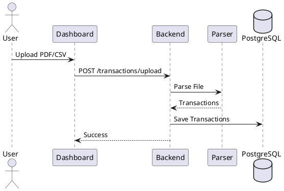
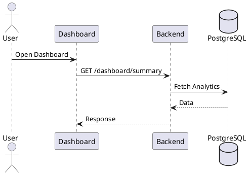
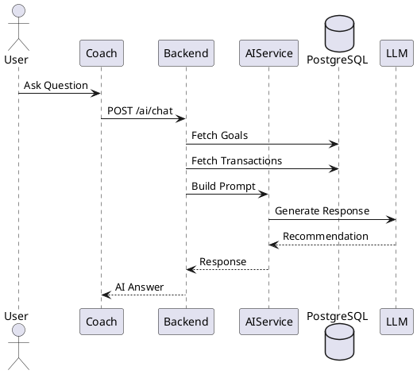

# AI Financial Coach - High Level Design (HLD)

## Version

2.0

## Author

Tushar Kumar

---

# 1. Executive Summary

AI Financial Coach is a personal finance platform that helps users understand their spending habits, track financial goals, and receive personalized AI-powered financial guidance.

Unlike traditional expense trackers, the primary focus of the platform is actionable financial advice rather than transaction management.

Users upload their transaction data through bank statements (PDF/CSV), and the system generates insights, recommendations, affordability analysis, and savings strategies using AI.

---

# 2. Product Vision

Current finance applications answer:

* What did I spend?
* Where did I spend?

AI Financial Coach answers:

* Can I afford this purchase?
* How can I save more?
* Why am I overspending?
* What should I do next?
* How can I reach my financial goals faster?

The application acts as a personal financial coach rather than a bookkeeping tool.

---

# 3. MVP Scope

## Included Features

### Authentication

* User Registration
* User Login
* JWT Authentication

### Transaction Management

* PDF Statement Upload
* CSV Statement Upload
* Transaction Extraction
* Transaction Categorization

### Dashboard

* Financial Overview
* Spending Analytics
* Spending Trends
* Goal Progress
* Recent Transactions

### AI Spend Coach

* Financial Health Score
* Personalized Recommendations
* Goal Tracking
* AI Chat Interface
* Affordability Analysis

---

## Excluded Features

### Future Scope

* UPI Integration
* Bank API Integration
* RAG
* Vector Databases
* Microservices
* Kafka
* Investment Recommendations
* Tax Planning
* Real-Time Transaction Sync

---

# 4. Technology Stack

## Frontend

```text
React
Vite
TypeScript
Tailwind CSS
Recharts
Axios
React Router
```

---

## Backend

```text
Java 21
Spring Boot 3
Spring Security
Spring Data JPA
JWT Authentication
```

---

## Database

```text
PostgreSQL
```

---

## AI Layer

```text
LLM API
(OpenAI or equivalent)
```

---

## Deployment

```text
Docker
Nginx
Cloud VM / VPS
```

---

# 5. High-Level Architecture

```text
┌────────────────────────────┐
│      React Frontend        │
│                            │
│ Dashboard                  │
│ AI Spend Coach             │
└─────────────┬──────────────┘
              │ HTTPS
              ▼
┌────────────────────────────┐
│   Spring Boot Monolith     │
│                            │
│ Auth Module                │
│ Transaction Module         │
│ Goal Module                │
│ Analytics Module           │
│ AI Coach Module            │
│ Notification Module        │
└─────────────┬──────────────┘
              │
              ▼
┌────────────────────────────┐
│         PostgreSQL         │
└────────────────────────────┘

External Services

- LLM Provider
- Email Provider
```

---

# 6. Architectural Style

The application follows a Modular Monolith architecture.

Benefits:

* Faster development
* Easier deployment
* Lower operational overhead
* Simpler debugging
* Easier onboarding for contributors

Future microservice extraction can occur if scale requires it.

---

# 7. Backend Module Design

```text
com.financecoach

├── auth
├── appUser
├── transaction
├── goal
├── analytics
├── ai
├── notification
├── common
└── config
```

Each module contains:

```text
controller
service
repository
entity
dto
mapper
```

Example:

```text
transaction

├── TransactionController
├── TransactionService
├── TransactionRepository
├── TransactionEntity
├── TransactionDTO
└── TransactionMapper
```

---

# 8. Frontend Architecture

## Application Pages

The MVP intentionally contains only two pages.

### Dashboard

Route:

```text
/
```

Purpose:

Financial overview and data ingestion.

### AI Spend Coach

Route:

```text
/coach
```

Purpose:

AI-powered financial guidance and planning.

---

# 9. Dashboard Design

## Purpose

The dashboard acts as the central hub of the application.

Users can:

* Upload statements
* View spending analytics
* Review transactions
* Monitor goals

---

## Dashboard Layout

```text
------------------------------------------------

Navbar

Dashboard
AI Coach

------------------------------------------------

Upload Statement

[ Upload PDF ]
[ Upload CSV ]

------------------------------------------------

Financial Summary

Income
Expenses
Savings
Savings Rate

------------------------------------------------

Monthly Spending Trend

(Line Chart)

------------------------------------------------

Category Breakdown

(Pie Chart)

------------------------------------------------

Goal Summary

Emergency Fund
Vacation Fund
Laptop Fund

------------------------------------------------

Recent Transactions

------------------------------------------------
```

---

## Dashboard Functionalities

### Statement Upload

Supported Formats:

* PDF
* CSV

Flow:

```text
Upload File
     │
     ▼
Backend Processing
     │
     ▼
Transaction Extraction
     │
     ▼
Categorization
     │
     ▼
Database Storage
     │
     ▼
Dashboard Refresh
```

---

### Financial Summary Cards

Displays:

* Total Income
* Total Expenses
* Total Savings
* Savings Rate

---

### Spending Trends

Displays:

* Monthly spending trends
* Historical comparisons

---

### Category Breakdown

Displays:

* Food
* Shopping
* Travel
* Bills
* Entertainment
* Other

---

### Recent Transactions

Displays:

* Merchant
* Amount
* Category
* Date

Supports:

* Search
* Filters
* Pagination

---

# 10. AI Spend Coach Design

## Purpose

The AI Spend Coach is the primary engagement feature of the application.

This page provides:

* Personalized recommendations
* Goal tracking
* Financial planning
* Affordability analysis

---

## Coach Layout

```text
------------------------------------------------

Financial Health Score

------------------------------------------------

Goal Progress

------------------------------------------------

AI Recommendations

------------------------------------------------

Chat Interface

------------------------------------------------

Suggested Questions

Can I afford a PS5?

Can I buy an iPhone?

How much should I save?

Am I overspending?

------------------------------------------------
```

---

## Features

### Financial Health Score

Calculated from:

* Savings Rate
* Spending Consistency
* Goal Progress
* Budget Compliance

Example:

```text
82 / 100
```

---

### Goal Tracking

Displays:

```text
Emergency Fund

₹40,000 / ₹1,00,000

40% Complete

Estimated Completion:
December 2026
```

---

### AI Recommendations

Examples:

```text
You spent 24% more on food this month.

Reducing delivery expenses by ₹2,000 will increase monthly savings by 18%.

You can reach your emergency fund goal 2 months earlier by reducing discretionary spending.
```

---

### AI Chat

Example Questions:

```text
Can I afford a PS5?

Can I buy a MacBook?

What subscriptions should I cancel?

How much can I spend this month?
```

---

### Affordability Analysis

Example:

User asks:

```text
Can I afford a PS5?
```

System evaluates:

* Current savings
* Spending patterns
* Goal commitments
* Monthly burn rate

AI responds:

```text
You can afford a PS5.

However, purchasing it this month would delay your emergency fund goal by approximately 12 days.
```

---

# 11. User Journey

## New User Flow

```text
Register
   │
   ▼
Login
   │
   ▼
Dashboard
   │
   ▼
Upload Statement
   │
   ▼
Transactions Parsed
   │
   ▼
Analytics Generated
   │
   ▼
Create Goal
   │
   ▼
Open AI Coach
   │
   ▼
Receive Recommendations
```

---

# 12. Request Flows

## Statement Upload Flow

### UML Sequence Diagram



---

## Dashboard Load Flow

### UML Sequence Diagram



---

## AI Coach Flow

### UML Sequence Diagram



---

# 13. Database Design

## users

```sql
CREATE TABLE users (
    id UUID PRIMARY KEY,
    name VARCHAR(255),
    email VARCHAR(255) UNIQUE,
    password_hash TEXT,
    created_at TIMESTAMP
);
```

---

## transactions

```sql
CREATE TABLE transactions (
    id UUID PRIMARY KEY,
    user_id UUID,
    amount DECIMAL(12,2),
    merchant VARCHAR(255),
    description TEXT,
    category VARCHAR(100),
    transaction_type VARCHAR(20),
    transaction_date DATE,
    created_at TIMESTAMP
);
```

---

## goals

```sql
CREATE TABLE goals (
    id UUID PRIMARY KEY,
    user_id UUID,
    goal_name VARCHAR(255),
    target_amount DECIMAL(12,2),
    current_amount DECIMAL(12,2),
    target_date DATE,
    status VARCHAR(50),
    created_at TIMESTAMP
);
```

---

## ai_chat_history

```sql
CREATE TABLE ai_chat_history (
    id UUID PRIMARY KEY,
    user_id UUID,
    question TEXT,
    response TEXT,
    created_at TIMESTAMP
);
```

---

# 14. API Design

## Authentication APIs

### Register

```http
POST /api/auth/register
```

### Login

```http
POST /api/auth/login
```

### Refresh Token

```http
POST /api/auth/refresh
```

---

## Transaction APIs

### Upload Statement

```http
POST /api/transactions/upload
```

### Get Transactions

```http
GET /api/transactions
```

### Get Categories

```http
GET /api/transactions/categories
```

---

## Dashboard APIs

### Summary

```http
GET /api/dashboard/summary
```

### Spending Trends

```http
GET /api/dashboard/trends
```

### Category Breakdown

```http
GET /api/dashboard/categories
```

### Goal Summary

```http
GET /api/dashboard/goals
```

---

## Goal APIs

### Create Goal

```http
POST /api/goals
```

### Get Goals

```http
GET /api/goals
```

---

## AI APIs

### AI Chat

```http
POST /api/ai/chat
```

### Generate Recommendations

```http
GET /api/ai/recommendations
```

### Financial Health Score

```http
GET /api/ai/health-score
```

### Affordability Analysis

```http
POST /api/ai/affordability
```

---

# 15. Security

## Authentication

* JWT Access Tokens
* Refresh Tokens

## Password Storage

* BCrypt Hashing

## API Security

* HTTPS
* Input Validation
* Rate Limiting
* Authorization Checks

---

# 16. Future Roadmap

### Phase 2

* Email Statement Parsing
* Subscription Detection
* Monthly Reports

### Phase 3

* UPI Integration
* Bank Integrations
* Automated Imports

### Phase 4

* Financial Health Benchmarking
* Investment Tracking
* Tax Planning Assistance

---

# 17. Success Metrics

Primary KPI:

> Percentage of users who return to interact with the AI Coach after uploading financial data.

Secondary Metrics:

* Statement upload success rate
* Monthly active users
* AI chat engagement
* Goal completion rate
* User retention

---

# 18. Final Architecture Summary

```text
Frontend
---------
React
Vite
TypeScript
TailwindCSS
Recharts

Backend
---------
Spring Boot Monolith
Spring Security
JWT
JPA

Database
---------
PostgreSQL

AI
---------
LLM API

Pages
---------
Dashboard
AI Spend Coach

Deployment
---------
Docker
Nginx
Cloud VM
```

This architecture prioritizes rapid development, low operational complexity, and validation of the core idea: helping users make better financial decisions through AI-powered coaching.
